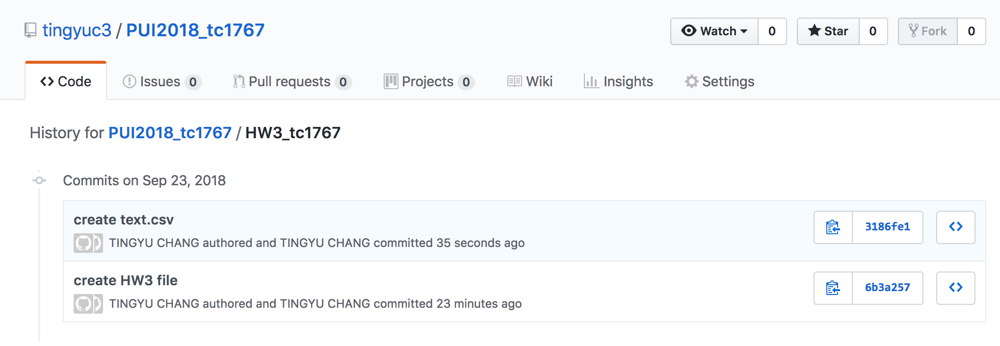

* This is for HW3 and I did HW3 alone.

Below are the screenshots for Assignment1.
Assignment 2 is called HW3_Assignment2.ipynb, Assignment 3 is called show_bus_locations_tc1767.py and Assignment 4 is called get_bus_info_tc1767.py

