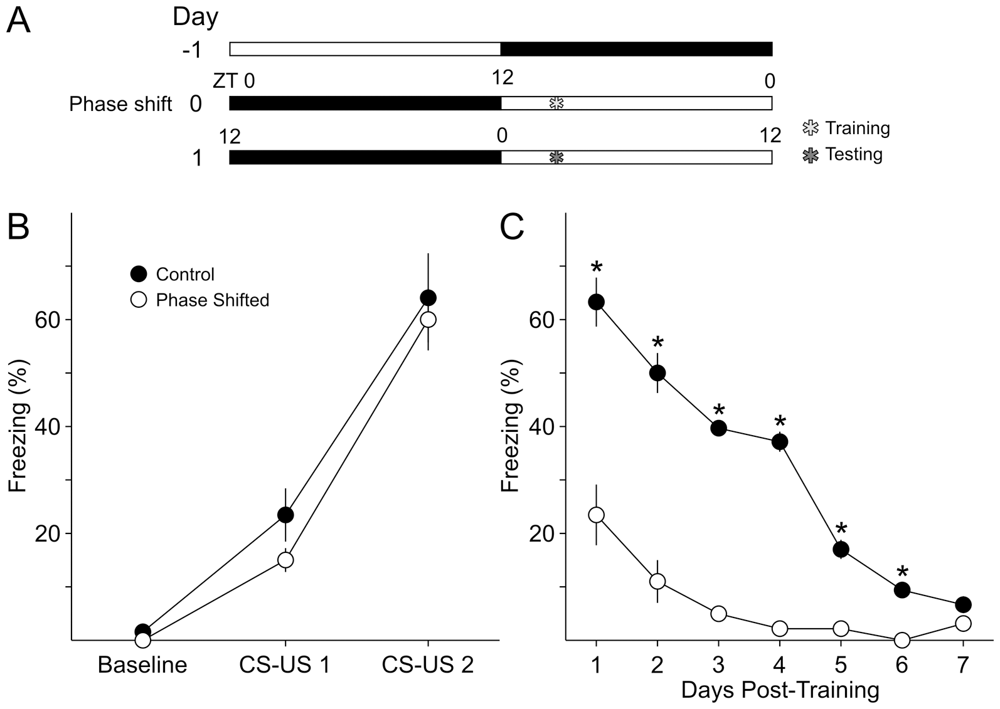
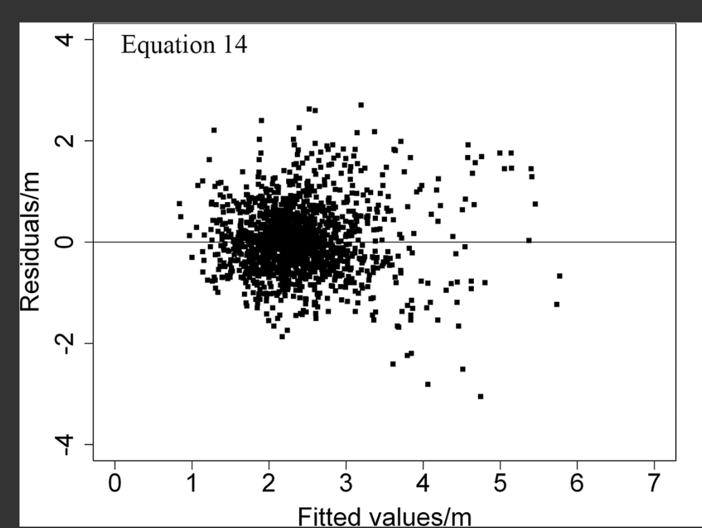
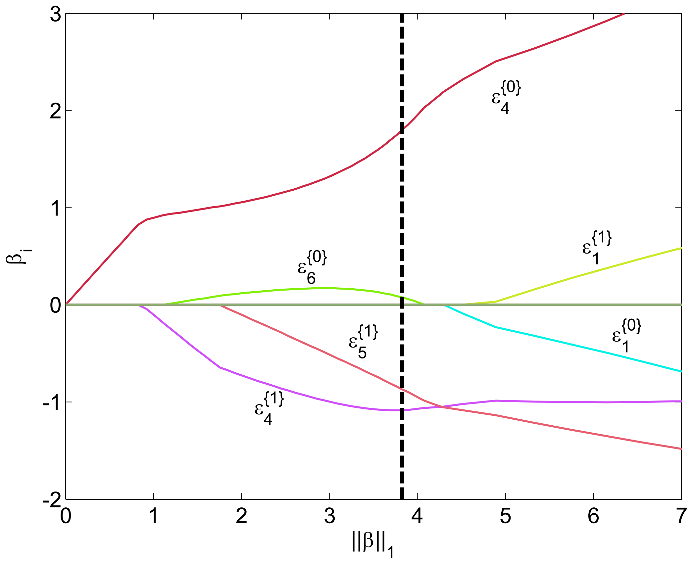

This is for HW5. I did Assignment 1, 3 and 4 on my own and Assignment 2 with Yuxuan Wang(yw1665). 
For Assignment 1, I inspected um367's Assignment 2 for HW4.
For Assignemnt 2, see below.
For Assignment 3, I use the z-test funciton and chi-square function to reproduce the analysis.
For Assignment 4, I use citibike data from 201412 and 201507 and run three tests to assess correlation between trip duration of day time and night time. 

For Assignment 2

 | **Statistical Analyses**	|  **IV(s)**  |  **IV type(s)** |  **DV(s)**  |  **DV type(s)**  |  **Control Var** | **Control Var type**  | **Question to be answered** | **_H0_** | **alpha** | **link to paper**| 
|:----------:|:----------|:------------|:-------------|:-------------|:------------|:------------- |:------------------|:----:|:-------:|:-------|
 ANOVA | 1,Phase shifted group of mice or no? | Categorical | 1, Percentage of Acquistion of Fear-conditioned Freezing | Continuous (percentage is always treated as continuous variable) |  None | None | If an acute light/dark phase shift prior to training would alter acquistion of fear conditioned freeze of mice?| Percentage of acquistion of fear conditioned freeze of phase shifted group of mice = Percentage of acquistion of fear conditioned freeze of normal mice | 0.05 | [Rapid Changes in the Light/Dark Cycle Disrupt Memory of Conditioned Fear in Mice](https://journals.plos.org/plosone/article?id=10.1371/journal.pone.0012546#pone-0012546-g001**)|
  |||||||||
 Multiple Regression	|  1, Diameter at Breast Height (DBH); 2, Tree Height (H); 3, Height to Crown Base (HCB); 4, Dominant Diameter at Breast Height (DD); 5 Site Index (SI), 6,Standard Density (SD); 7, (Quadratic Mean Diameter) QMD; 8, Basal Area (BA)  |  1, Continuous; 2, Continuous; 3, Continuous, 4, Continous; 5, Continous; 6, Continous; 7, Continous; 8, Continous; |  1, Crown Width (CW) | Continuous | None | None  | How to predict crown width of China-fir precisely based on the crown data | None | 0.05 (Feature Selection ) | [Linear Mixed-Effects Models to Describe Individual Tree Crown Width for China-Fir in Fujian Province, Southeast China](https://journals.plos.org/plosone/article?id=10.1371/journal.pone.0122257#pone-0122257-t001)|
  |||||||||
 Logistic Regression	| 1, EDF Similarity Scores of First Feature of Tube 4; 2,EDF Similarity Scores of Second Feature of Tube 4; 3, EDF Similarity Scores of Second Feature of Tube 5; 4, EDF Similarity Scores of First Feature of Tube 6; | Continuous |  AML-positive  |  Categorical  |  none | none | How to predict acute myeloid leukemia (AML) from patient samples based on flow cytometry measurements ? | None | 0.05 (Feature Selection ) | [Leukemia Prediction Using Sparse Logistic Regression] (https://journals.plos.org/plosone/article?id=10.1371/journal.pone.0072932)| 
  |||||||||

Paper 1 (ANOVA):

Paper 2 (Multiple Regression):

Paper 3 (Logistic Regression)

