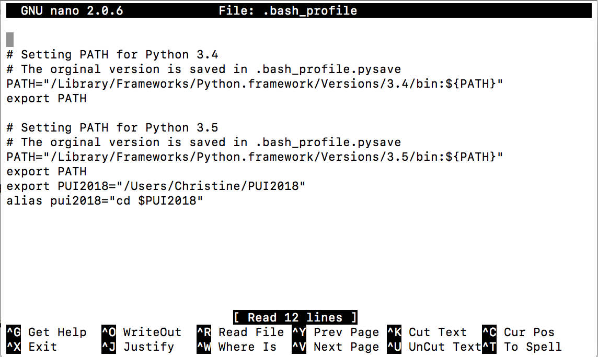
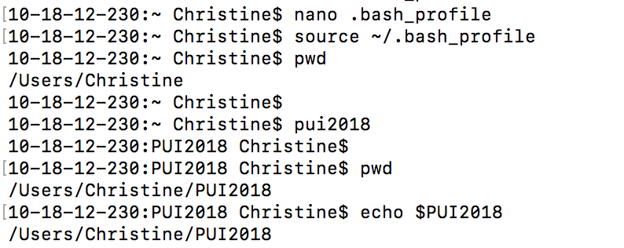

# PUI2018_tc1767
This repository is for Principles of Urban Informatics 2018.

Setting up the environment:
1. Create a directory on the computer called PUI2018
2. Go back to home directory and type: nano .bash_profile
3. Inside the bash_profile, edit like below

4. Exit the bash_profile and type: source ~/.bash_profile
5. In home directory

    
